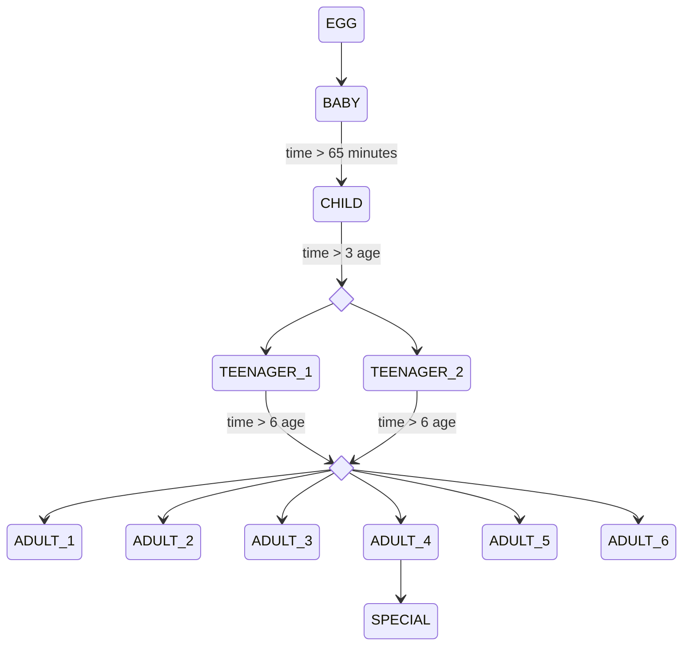
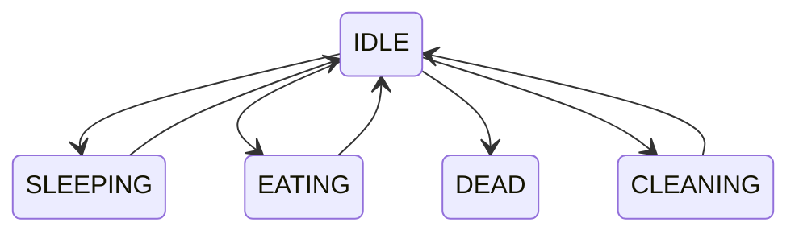
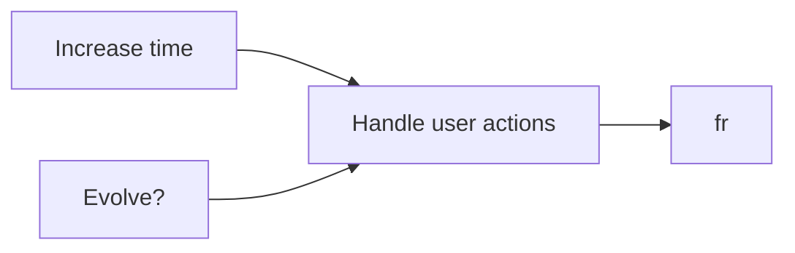
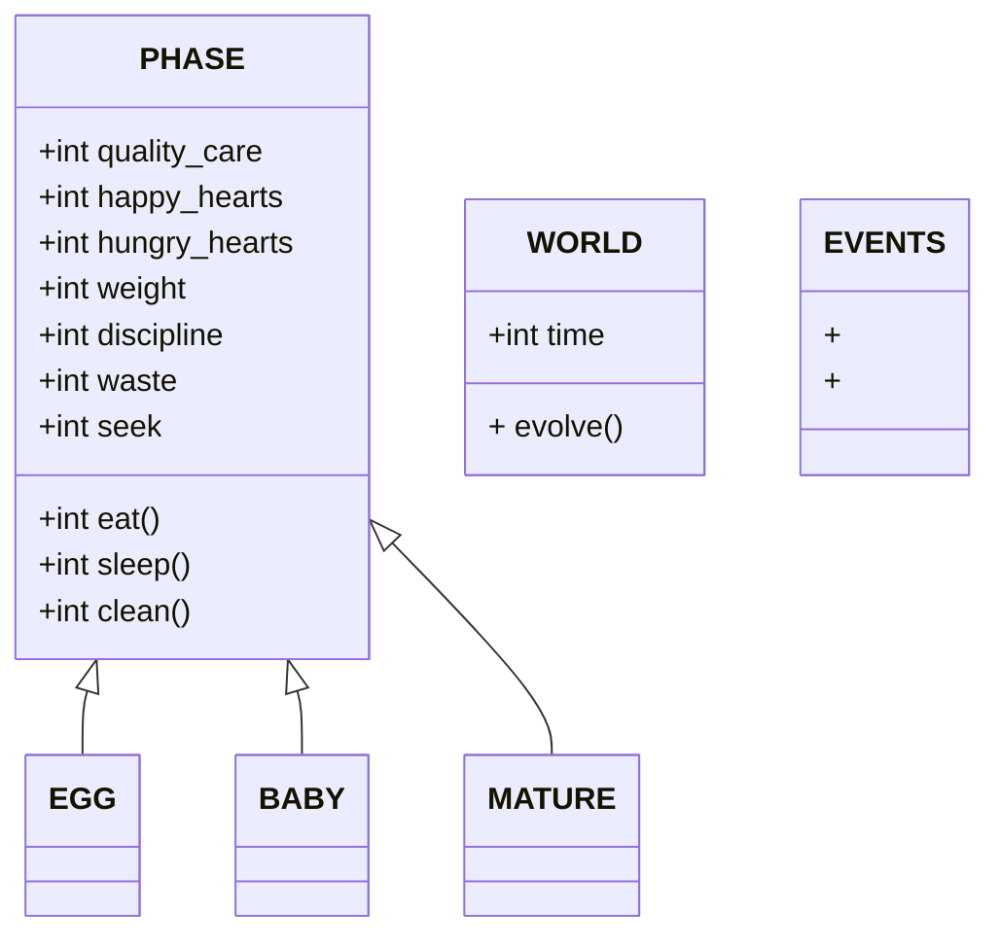

## Stages of life

```mermaid
  stateDiagram-v2
    state TEEN_CHOICE <<choice>>
    state ADULT_CHOICE <<choice>>
    EGG --> BABY
    BABY --> CHILD: time > 65 minutes
    CHILD --> TEEN_CHOICE: time > 3 age
    TEEN_CHOICE --> TEENAGER_1
    TEEN_CHOICE --> TEENAGER_2
    TEENAGER_1 --> ADULT_CHOICE: time > 6 age
    TEENAGER_2 --> ADULT_CHOICE: time > 6 age
    ADULT_CHOICE --> ADULT_1
    ADULT_CHOICE --> ADULT_2
    ADULT_CHOICE --> ADULT_3
    ADULT_CHOICE --> ADULT_4
    ADULT_4 --> SPECIAL
    ADULT_CHOICE --> ADULT_5
    ADULT_CHOICE --> ADULT_6
```

## Creature states

```mermaid
  stateDiagram-v2
    IDLE --> SLEEPING
    SLEEPING --> IDLE
    IDLE --> EATING
    EATING --> IDLE
    IDLE --> DEAD
    IDLE --> CLEANING
    CLEANING --> IDLE
```

## Software cycles

```mermaid
  flowchart LR
    INC_TIME[Increase time] --> USER_ACTION
    EVOLVE[Evolve?] --> USER_ACTION
    USER_ACTION[Handle user actions] --> fr
```

## Classes

```mermaid
  classDiagram
    PHASE <|-- EGG
    PHASE <|-- BABY
    PHASE <|-- MATURE
    PHASE: +int quality_care
    PHASE: +int happy_hearts
    PHASE: +int hungry_hearts
    PHASE: +int weight 
    PHASE: +int discipline 
    PHASE: +int waste    
    PHASE: +int seek
    
    
    PHASE: +int eat()
    PHASE: +int sleep()
    PHASE: +int clean()
    class EGG{
    }
    class BABY{
    }
    class MATURE{
    }
    class WORLD{
    +int time
    + evolve()
    }
    
    class EVENTS{
    +
    + 
    }
```
