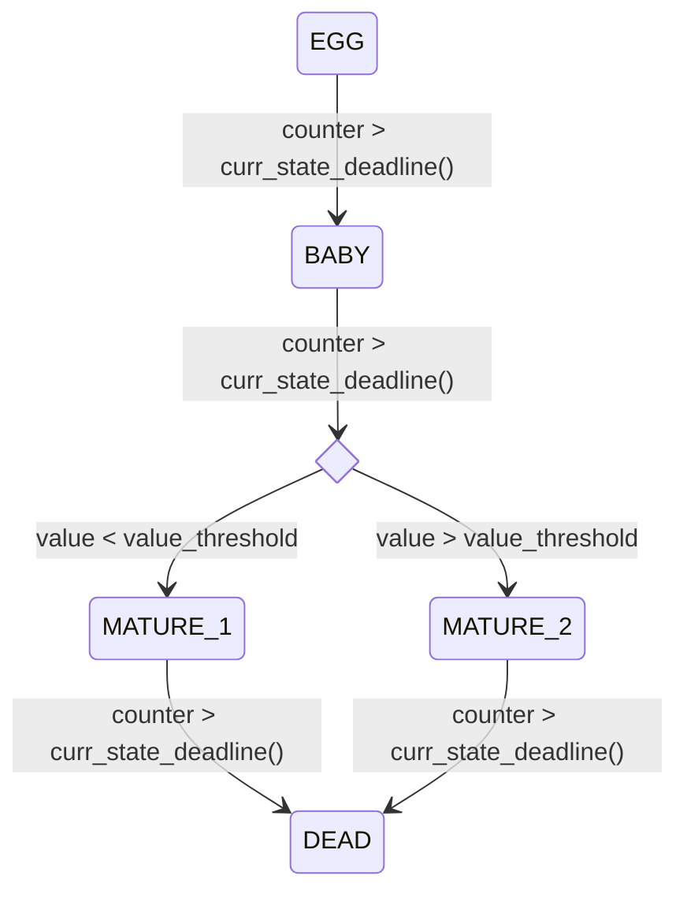

## Creature growth process

```mermaid
  stateDiagram-v2
    state if_state <<choice>>
    EGG --> BABY: counter > curr_state_deadline()
    BABY --> if_state: counter > curr_state_deadline()
    if_state --> MATURE_1: value < value_threshold
    if_state --> MATURE_2: value > value_threshold
    MATURE_1 --> DEAD: counter > curr_state_deadline()
    MATURE_2 --> DEAD: counter > curr_state_deadline()
```

## Creature states
