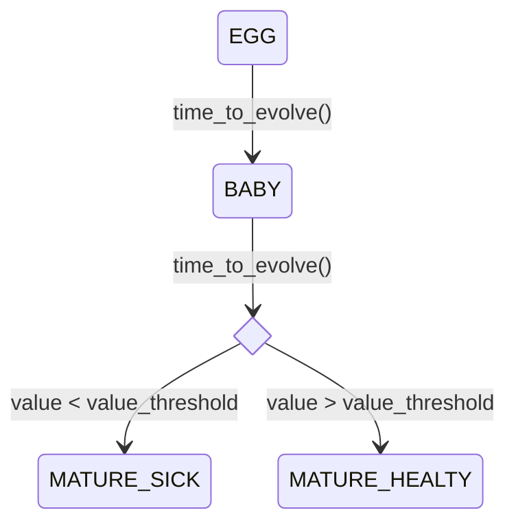
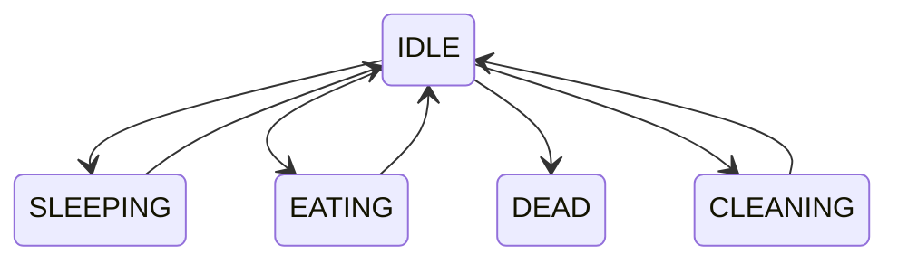
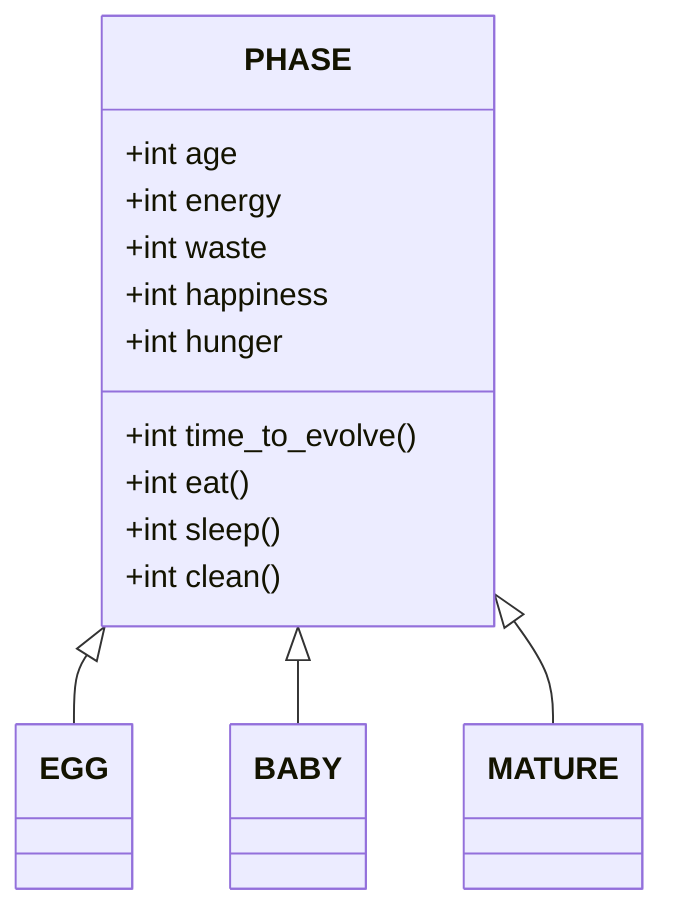

## Creature growth process

```mermaid
  stateDiagram-v2
    state if_state <<choice>>
    EGG --> BABY: time_to_evolve()
    BABY --> if_state: time_to_evolve()
    if_state --> MATURE_SICK: value < value_threshold
    if_state --> MATURE_HEALTY: value > value_threshold
```

## Creature states

```mermaid
  stateDiagram-v2
    IDLE --> SLEEPING
    SLEEPING --> IDLE
    IDLE --> EATING
    EATING --> IDLE
    IDLE --> DEAD
    IDLE --> CLEANING
    CLEANING --> IDLE
```

## Creature attributes

```mermaid
  classDiagram
    PHASE <|-- EGG
    PHASE <|-- BABY
    PHASE <|-- MATURE
    PHASE: +int age
    PHASE: +int energy
    PHASE: +int waste
    PHASE: +int happiness
    PHASE: +int hunger
    PHASE: +int time_to_evolve()
    PHASE: +int eat()
    PHASE: +int sleep()
    PHASE: +int clean()
    class EGG{
    }
    class BABY{
    }
    class MATURE{
    }
```
